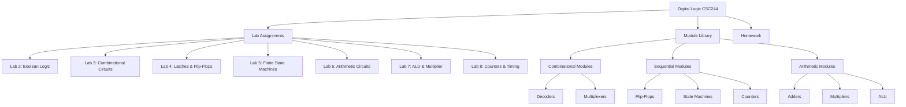

# Digital Logic Design - CSC244 Course Projects

A comprehensive collection of SystemVerilog hardware designs for Intel MAX 10 FPGA, covering fundamental and intermediate digital logic concepts. This repository contains lab assignments, homework solutions, and a reusable module library developed for a university-level Digital Logic Design course.

## 🎯 Key Features

- **8 Progressive Lab Assignments** - Hands-on projects covering Boolean algebra through sequential logic circuits
- **Reusable Module Library** - 20+ parameterized SystemVerilog modules for common digital components
- **FPGA-Verified Designs** - All projects tested on Intel DE10-Lite development board (MAX 10 FPGA)
- **Complete Documentation** - Each lab includes PDFs, schematics, and implementation notes
- **Production-Ready Code** - Synthesizable SystemVerilog following industry best practices

## 📋 Table of Contents

- [Architecture Overview](#architecture-overview)
- [Hardware Requirements](#hardware-requirements)
- [Quick Start](#quick-start)
- [Project Structure](#project-structure)
- [Lab Assignments](#lab-assignments)
- [Module Library Reference](#module-library-reference)
- [Usage](#usage)
- [Development](#development)
- [What This Project Demonstrates](#what-this-project-demonstrates)
- [Contributing](#contributing)
- [License](#license)

## 🏗️ Architecture Overview

This repository follows a modular architecture with three main components:



**Design Philosophy**: Each module is self-contained and parameterized for reusability. Complex circuits are built by composing simpler modules, following hierarchical design principles.

For detailed architecture documentation, see [docs/ARCHITECTURE.md](docs/ARCHITECTURE.md).

## 🔧 Hardware Requirements

### Required Hardware
- **Intel DE10-Lite FPGA Board**
  - Device: 10M50DAF484C7G (MAX 10 FPGA)
  - 50,000 logic elements
  - 50 MHz on-board oscillator
  - 10 user LEDs, 10 switches, 2 push buttons
  - Six 7-segment displays
  - Arduino header for I/O expansion

### Required Software
- **Intel Quartus Prime Lite Edition** (v22.1std.1 or later)
  - Free download from Intel FPGA website
  - Includes synthesis, place-and-route, and programming tools
  - Integrated ModelSim for simulation (optional)

### Optional Tools
- **Oscilloscope** - For Lab 8 timing verification
- **USB Blaster Cable** - Usually integrated on DE10-Lite board

## 🚀 Quick Start

### 1. Prerequisites

Install Intel Quartus Prime Lite Edition:
```bash
# Download from: https://www.intel.com/content/www/us/en/software-kit/785085/intel-quartus-prime-lite-edition-design-software-version-22-1-1-for-windows.html
# Follow Intel's installation guide for your platform
```

### 2. Clone Repository

```bash
git clone https://github.com/jakujobi/Digital-Logic-CSC244.git
cd Digital-Logic-CSC244
```

### 3. Open a Lab Project

```bash
# Navigate to a lab directory (example: Lab 8)
cd "Lab 8 - Counters Shift Reg/L8 Giant Counter"

# Open the Quartus project file
quartus giant_counter.qpf
```

### 4. Compile and Program

In Quartus Prime:
1. **Analysis & Synthesis**: `Processing > Start > Start Analysis & Synthesis`
2. **Compile**: Click the "Start Compilation" button (or `Processing > Start Compilation`)
3. **Program**: Connect DE10-Lite board via USB
   - `Tools > Programmer`
   - Click "Auto Detect" (should show 10M50DA)
   - Add `.sof` file from `output_files/` directory
   - Click "Start" to program the FPGA

### 5. Verify Operation

- Toggle switches, press buttons, observe LEDs and 7-segment displays
- Refer to each lab's PDF for expected behavior

## 📁 Project Structure

```
Digital-Logic-CSC244/
├── Lab 2 - DeMorgan SOP POS/        # Boolean algebra, DeMorgan's laws
│   ├── L2 SV Files/                 # SystemVerilog implementations
│   ├── CSC244 Lab 2 FA23.pdf        # Lab manual
│   └── *.cv                         # Circuit simulation files
│
├── Lab 3 - CBB - 7 Seg Display/     # Decoders and 7-segment displays
│   ├── L3 SV Files Struct/          # Decoder implementations
│   └── *.cv                         # Circuit diagrams
│
├── Lab 4 Flipflops/                 # Sequential logic fundamentals
│   ├── L4 3-1-1 SR-Latch/           # SR latch implementation
│   ├── L4 3-1-2 D-Latch/            # D latch implementation
│   ├── L4 3.2 Flipflops/            # D, T, JK flip-flops
│   └── L4 SV files/                 # All flip-flop modules
│
├── Lab 5 Seq Detector/              # Finite state machines
│   ├── L5 SV Files/                 # Mealy and Moore FSMs
│   └── CSC244_Lab_5.pdf             # Lab manual
│
├── Lab 6 Adder Subtracter/          # Arithmetic circuits
│   ├── L6 SV Files/                 # Adder/subtractor modules
│   └── CSC244_Lab_6.pdf             # Lab manual
│
├── Lab 7 - Multiplier ALU/          # Complex arithmetic units
│   ├── L7 Multiplier/               # 4-bit array multiplier
│   ├── L7 ALU/                      # 8-bit ALU
│   └── CSC244_Lab_7.pdf             # Lab manual
│
├── Lab 8 - Counters Shift Reg/      # Timing and frequency division
│   ├── L8 Giant Counter/            # 26-bit counter (1 Hz from 50 MHz)
│   └── *.sv                         # Counter implementations
│
├── Homework/                        # Course homework assignments
│   ├── HW 1/                        # Boolean algebra problems
│   ├── HW 2/                        # Combinational logic
│   ├── HW 3/                        # Karnaugh maps
│   └── HW 4/                        # Sequential circuits
│
├── SV Modules Bank/                 # Reusable module library
│   ├── ALU.sv                       # 8-bit ALU (ADD, SUB, AND, OR)
│   ├── fulladder.sv                 # 1-bit full adder
│   ├── sequenceDetectorMealy.sv     # Mealy FSM (sequence: 1010)
│   ├── sequenceDetectorMoore.sv     # Moore FSM
│   ├── counter26bit.sv              # Parameterized 26-bit counter
│   ├── debouncer.sv                 # Switch debouncing circuit
│   ├── mult4.sv                     # 4-bit array multiplier
│   ├── dec416.sv                    # 4-to-16 decoder
│   ├── decimal7decoder.sv           # 7-segment display decoder
│   ├── regN.sv                      # N-bit register
│   └── [15 more modules...]         # See Module Library section
│
├── .vscode/                         # VS Code configuration
│   └── tasks.json                   # C++ build tasks
│
├── LICENSE                          # GNU GPL v3.0
└── README.md                        # This file
```

## 🧪 Lab Assignments

### Lab 2: Boolean Algebra and Logic Gates
**Topics**: DeMorgan's laws, Sum-of-Products (SOP), Product-of-Sums (POS)
- Implements Boolean functions using basic logic gates
- Demonstrates equivalence of different Boolean expressions
- **Files**: [`Lab 2 - DeMorgan SOP POS/`](Lab%202%20-%20DeMorgan%20SOP%20POS/)

### Lab 3: Combinational Building Blocks
**Topics**: Decoders, 7-segment displays, combinational logic design
- 4-to-16 decoder implementation
- Binary to 7-segment decoder for hexadecimal display
- **Files**: [`Lab 3 - CBB - 7 Seg Display/`](Lab%203%20-%20CBB%20-%207%20Seg%20Display/)
- **Key Modules**: `dec416.sv`, `seven_seg.sv`

### Lab 4: Latches and Flip-Flops
**Topics**: Sequential logic, SR latch, D latch, D/T/JK flip-flops
- Build sequential storage elements from scratch
- Implement switch debouncing for reliable user input
- **Files**: [`Lab 4 Flipflops/`](Lab%204%20Flipflops/)
- **Key Modules**: `sr_latch.sv`, `d_latch.sv`, `d_ff.sv`, `t_ff.sv`, `jk_ff.sv`, `debouncer.sv`

### Lab 5: Sequence Detector
**Topics**: Finite State Machines (FSM), Mealy vs Moore machines
- Detect the sequence "1010" from serial input
- Compare Mealy and Moore state machine implementations
- **Files**: [`Lab 5 Seq Detector/`](Lab%205%20Seq%20Detector/)
- **Key Modules**: `sequenceDetectorMealy.sv`, `sequenceDetectorMoore.sv`

### Lab 6: Adder and Subtractor
**Topics**: Arithmetic circuits, ripple-carry adder, 2's complement
- 1-bit and 4-bit full adders
- Combined adder/subtractor using 2's complement
- Binary to decimal conversion for 7-segment display
- **Files**: [`Lab 6 Adder Subtracter/`](Lab%206%20Adder%20Subtracter/)
- **Key Modules**: `fulladder.sv`, `adder4.sv`, `addsub4.sv`

### Lab 7: Multiplier and ALU
**Topics**: Array multiplier, Arithmetic Logic Unit, partial products
- 4-bit array multiplier using partial product method
- 8-bit ALU supporting ADD, SUB, AND, OR operations
- Status flags: overflow, carry, negative, zero
- **Files**: [`Lab 7 - Multiplier ALU/`](Lab%207%20-%20Multiplier%20ALU/)
- **Key Modules**: `mult4.sv`, `PP4.sv`, `ALU.sv`, `ALUcontroller.sv`

### Lab 8: Counters and Shift Registers
**Topics**: Counters, frequency division, timing circuits
- 26-bit counter for frequency division (50 MHz → 1 Hz)
- Implement 74x163-compatible counter with load/clear
- Generate 1 Hz blinking LED (1 second period, 50% duty cycle)
- **Files**: [`Lab 8 - Counters Shift Reg/`](Lab%208%20-%20Counters%20Shift%20Reg/)
- **Key Modules**: `counter26bit.sv`, `Lab_8.sv`

## 📚 Module Library Reference

The `SV Modules Bank/` directory contains production-ready SystemVerilog modules organized by category:

### Arithmetic & Logic Modules

| Module | Description | Parameters | Inputs | Outputs |
|--------|-------------|------------|--------|---------|
| **ALU.sv** | 8-bit Arithmetic Logic Unit | N=8 | A[7:0], B[7:0], ALUControl[1:0] | Result[7:0], V, C, Neg, Z |
| **fulladder.sv** | 1-bit full adder | - | A, B, Cin | S, Cout |
| **adder4.sv** | 4-bit ripple-carry adder | - | A[3:0], B[3:0], Cin | S[3:0], Cout |
| **addsub4.sv** | 4-bit adder/subtractor | - | A[3:0], B[3:0], Sub | Result[3:0], Cout, V |
| **mult4.sv** | 4-bit array multiplier | - | A[3:0], B[3:0] | P[7:0] |
| **PP4.sv** | Partial product generator | - | A[3:0], B, PPrev[3:0] | P[4:0] |

**ALU Operations**: 
- `2'b00`: ADD (addition)
- `2'b01`: SUB (subtraction)
- `2'b10`: AND (bitwise AND)
- `2'b11`: OR (bitwise OR)

### Sequential Logic Modules

| Module | Description | Features |
|--------|-------------|----------|
| **sequenceDetectorMealy.sv** | Mealy FSM sequence detector | Detects "1010", outputs on same cycle |
| **sequenceDetectorMoore.sv** | Moore FSM sequence detector | Detects "1010", outputs on next cycle |
| **sr_latch.sv** | SR latch | Set-reset latch with enable |
| **d_latch.sv** | D latch | Data latch with enable |
| **d_ff.sv** | D flip-flop | Positive edge-triggered |
| **t_ff.sv** | T flip-flop | Toggle flip-flop |
| **jk_ff.sv** | JK flip-flop | Most versatile flip-flop type |
| **regN.sv** | N-bit register | Parameterized width |

### Counter Modules

| Module | Description | Parameters | Key Features |
|--------|-------------|------------|--------------|
| **counter26bit.sv** | 26-bit counter with load/clear | N=26 | Counts to 50M (1 Hz from 50 MHz), RCO output, half-second flag |
| **giant_counter.sv** | Top-level counter demo | - | Debounced inputs, LED output |

### Decoder & Display Modules

| Module | Description | Inputs | Outputs |
|--------|-------------|--------|---------|
| **dec416.sv** | 4-to-16 decoder | in[3:0], enable | out[15:0] |
| **decimal7decoder.sv** | 7-segment display decoder | SW[3:0] | numHEX[6:0], signHEX[6:0] |
| **binary4todecimal7decoder.sv** | Binary to decimal converter | Binary[3:0] | 7-segment encoding |

### Utility Modules

| Module | Description | Purpose |
|--------|-------------|---------|
| **debouncer.sv** | Switch debouncer | Eliminates mechanical switch bounce using 50 MHz clock |
| **controller.sv** | Generic controller | State machine controller for complex systems |
| **ALUcontroller.sv** | ALU control logic | Generates ALU operation codes |

## 💻 Usage

### Using Individual Modules

To use a module from the library in your design:

```systemverilog
// Example: Using the ALU module in a top-level design
module my_processor(
    input logic [7:0] data_a, data_b,
    input logic [1:0] operation,
    output logic [7:0] result,
    output logic overflow, carry, negative, zero
);

    // Instantiate the 8-bit ALU
    ALU #(.N(8)) alu_unit (
        .A(data_a),
        .B(data_b),
        .ALUControl(operation),
        .Result(result),
        .V(overflow),
        .C(carry),
        .Neg(negative),
        .Z(zero)
    );

endmodule
```

### Common Design Patterns

#### 1. Hierarchical Composition
```systemverilog
// Build a 4-bit adder from full adders
module adder4(
    input logic [3:0] A, B,
    input logic Cin,
    output logic [3:0] Sum,
    output logic Cout
);
    logic [2:0] carry;
    
    fulladder fa0(.A(A[0]), .B(B[0]), .Cin(Cin),      .S(Sum[0]), .Cout(carry[0]));
    fulladder fa1(.A(A[1]), .B(B[1]), .Cin(carry[1]), .S(Sum[1]), .Cout(carry[1]));
    fulladder fa2(.A(A[2]), .B(B[2]), .Cin(carry[1]), .S(Sum[2]), .Cout(carry[2]));
    fulladder fa3(.A(A[3]), .B(B[3]), .Cin(carry[2]), .S(Sum[3]), .Cout(Cout));
endmodule
```

#### 2. Parameterized Designs
```systemverilog
// Instantiate different ALU sizes
ALU #(.N(4))  alu_4bit  (...);  // 4-bit ALU
ALU #(.N(8))  alu_8bit  (...);  // 8-bit ALU (default)
ALU #(.N(16)) alu_16bit (...);  // 16-bit ALU
```

#### 3. Clock Domain Crossing
```systemverilog
// Debounce a button before using in sequential logic
logic button_clean;
debouncer db (
    .A(button_clean),
    .CLK50M(clk_50mhz),
    .A_noisy(button_raw)
);
```

### Testing Your Design

1. **Functional Simulation** (optional, requires ModelSim):
```bash
# Compile testbench and design
vlog testbench.sv design.sv

# Run simulation
vsim -c testbench -do "run -all; quit"
```

2. **Synthesis and FPGA Testing**:
- Always preferable to test on actual hardware
- Use switches for inputs, LEDs for outputs
- 7-segment displays for viewing numeric results

## 🔨 Development

See [docs/DEVELOPMENT.md](docs/DEVELOPMENT.md) for detailed development setup instructions.

### Quick Development Guide

**Environment Setup**:
1. Install Intel Quartus Prime Lite Edition
2. Connect DE10-Lite board via USB
3. Install USB Blaster drivers (usually automatic)

**Creating a New Project**:
```bash
# Start Quartus
quartus &

# File > New Project Wizard
# - Set working directory
# - Add SystemVerilog files
# - Select device: 10M50DAF484C7G
```

**Pin Assignment**:
- Import pin assignments from existing `.qsf` files in lab directories
- Or use `Assignments > Pin Planner` to assign manually
- Common pins:
  - `CLK` → PIN_P11 (50 MHz oscillator)
  - `SW[0-9]` → PIN_C10..PIN_D12
  - `LEDR[0-9]` → PIN_A8..PIN_A10

**Compilation Workflow**:
1. Edit `.sv` files in any text editor
2. Analysis & Synthesis (verify syntax)
3. Full Compilation (generate `.sof` file)
4. Program FPGA via Programmer tool

**Best Practices**:
- Use descriptive signal names
- Comment complex logic blocks
- Test incrementally (add features one at a time)
- Save working configurations before major changes

## 🎓 What This Project Demonstrates

This repository showcases skills relevant to digital design and FPGA development roles:

### Hardware Design Skills
- **RTL Design** → Synthesizable SystemVerilog for FPGA implementation
  - See: [`SV Modules Bank/ALU.sv`](SV%20Modules%20Bank/ALU.sv), [`mult4.sv`](SV%20Modules%20Bank/mult4.sv)
- **Sequential Logic** → Finite state machines, registers, counters
  - See: [`sequenceDetectorMealy.sv`](SV%20Modules%20Bank/sequenceDetectorMealy.sv), [`counter26bit.sv`](SV%20Modules%20Bank/counter26bit.sv)
- **Combinational Logic** → Decoders, multiplexers, arithmetic circuits
  - See: [`dec416.sv`](SV%20Modules%20Bank/dec416.sv), [`fulladder.sv`](SV%20Modules%20Bank/fulladder.sv)
- **Timing & Clocking** → Clock division, frequency generation, synchronous design
  - See: [`Lab 8 - Counters Shift Reg/`](Lab%208%20-%20Counters%20Shift%20Reg/)

### Design Methodologies
- **Hierarchical Design** → Building complex systems from simple, reusable modules
  - Example: [`Lab 7 - Multiplier ALU/`](Lab%207%20-%20Multiplier%20ALU/) composes adders into multipliers into ALU
- **Parameterized Modules** → Generic, configurable components
  - See: `ALU.sv` (parameter N for bit width), `regN.sv`, `counter26bit.sv`
- **Design Patterns** → Debouncing, edge detection, state machine templates
  - See: [`debouncer.sv`](SV%20Modules%20Bank/debouncer.sv)

### FPGA Development
- **Intel Quartus Prime** → FPGA toolchain proficiency (synthesis, place-and-route, programming)
  - 12 complete Quartus projects with `.qpf`, `.qsf` pin assignments
- **Hardware Verification** → Testing designs on actual FPGA hardware (DE10-Lite)
  - All labs verified on MAX 10 FPGA
- **Constraint Management** → Pin assignments, clock constraints, device configuration
  - See: Any `.qsf` file in lab directories

### Problem-Solving Approaches
- **Incremental Development** → Build complexity gradually (latches → flip-flops → counters → FSMs)
  - Progression visible across Labs 4-8
- **Debugging** → Hardware debugging using LEDs, 7-segment displays, oscilloscope
  - See: Lab 8 oscilloscope verification of 1 Hz output
- **Documentation** → Clear code comments, module headers, signal descriptions
  - All modules include purpose, parameters, and interface documentation

### Academic Rigor
- **Theoretical Foundation** → Boolean algebra, state machine theory, arithmetic algorithms
  - Labs 2-3: Boolean algebra, Karnaugh maps
  - Lab 5: FSM theory (Mealy vs Moore)
  - Lab 7: Partial product multiplication algorithm
- **Complete Project Lifecycle** → Specification → Design → Implementation → Verification
  - Each lab includes PDF specification and working implementation

## 🤝 Contributing

This is an educational repository. While it's primarily for coursework demonstration, suggestions for improvements are welcome.

**If you're a student**: Use this as a reference, but write your own code. Understanding is more valuable than copying.

**If you're an educator**: Feel free to reference these labs. Attribution appreciated.

**For issues or suggestions**:
1. Check existing issues first
2. Open a new issue with clear description
3. For code improvements, include rationale and benefits

## 📄 License

This project is licensed under the **GNU General Public License v3.0** - see the [LICENSE](LICENSE) file for details.

**What this means**:
- ✅ You can view, use, and learn from this code
- ✅ You can modify and distribute derivatives under GPL-3.0
- ✅ You must disclose source code of derivatives
- ❌ No warranty provided (use at your own risk)

**Academic Integrity**: If you're a student in a similar course, check your institution's academic honesty policy before using this code. Learning happens through doing, not copying.

## 🙏 Acknowledgments

- **Intel Corporation** - For Quartus Prime Lite Edition and DE10-Lite documentation
- **Course Instructor** - CSC244 Digital Logic Design course structure and lab specifications
- **Terasic** - DE10-Lite board design and reference materials

## 📬 Contact

**Author**: John Akujobi  
**Repository**: [github.com/jakujobi/Digital-Logic-CSC244](https://github.com/jakujobi/Digital-Logic-CSC244)

For questions about this repository:
- Open an issue on GitHub
- Review lab PDFs for assignment-specific questions
- Check [docs/ARCHITECTURE.md](docs/ARCHITECTURE.md) for design details

---

**Last Updated**: February 2024  
**Quartus Version**: 22.1std.1 Lite Edition  
**Hardware Platform**: Intel MAX 10 FPGA (10M50DAF484C7G)