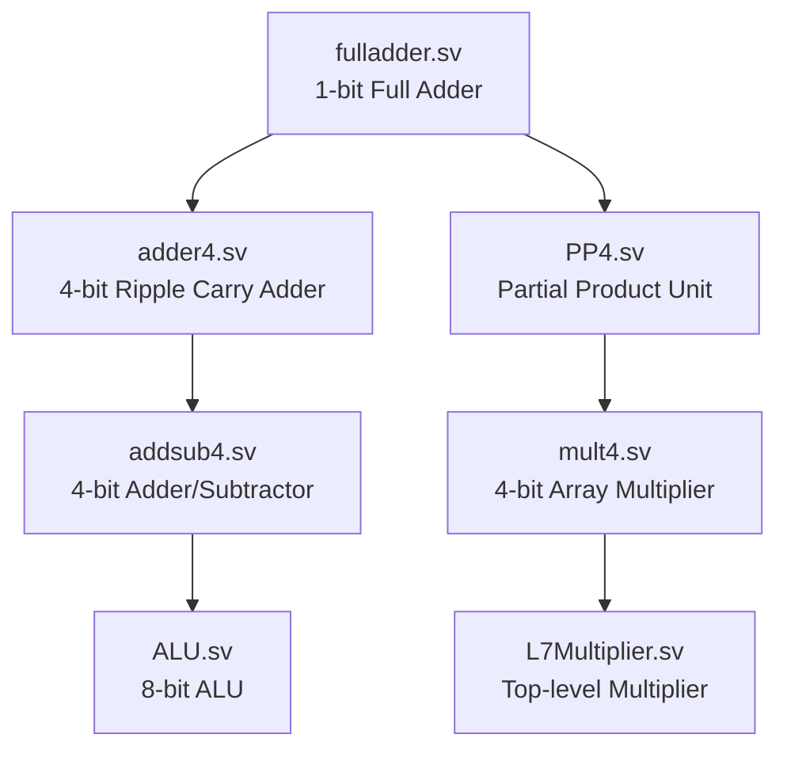
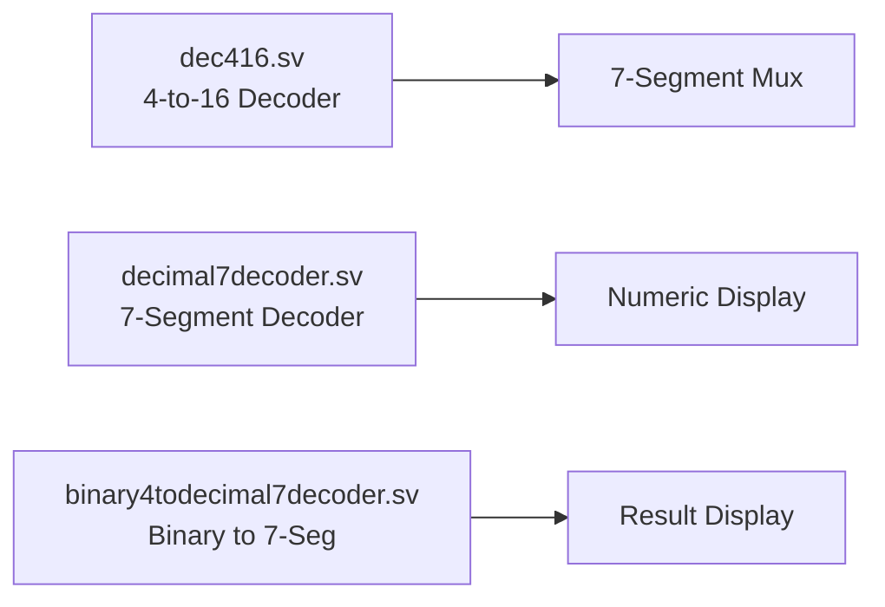
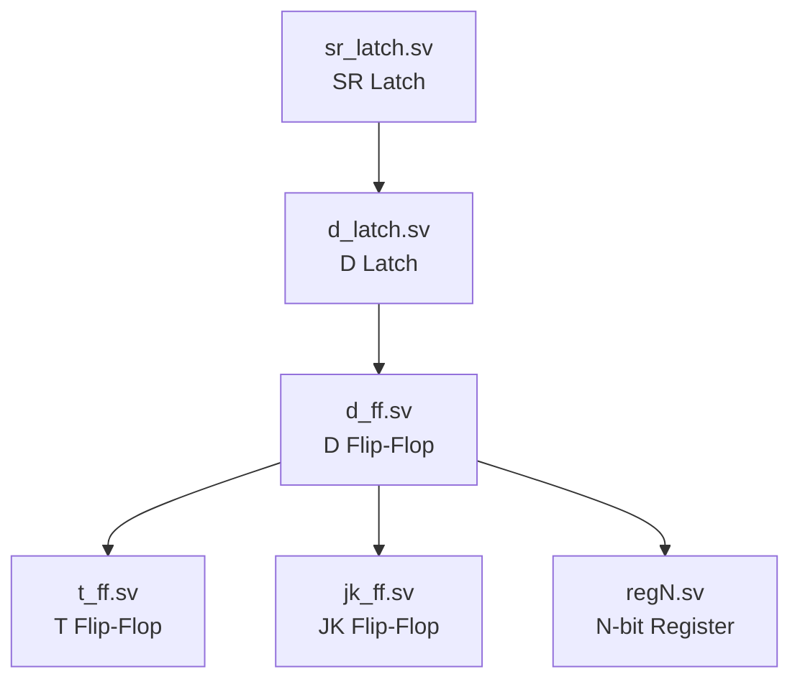
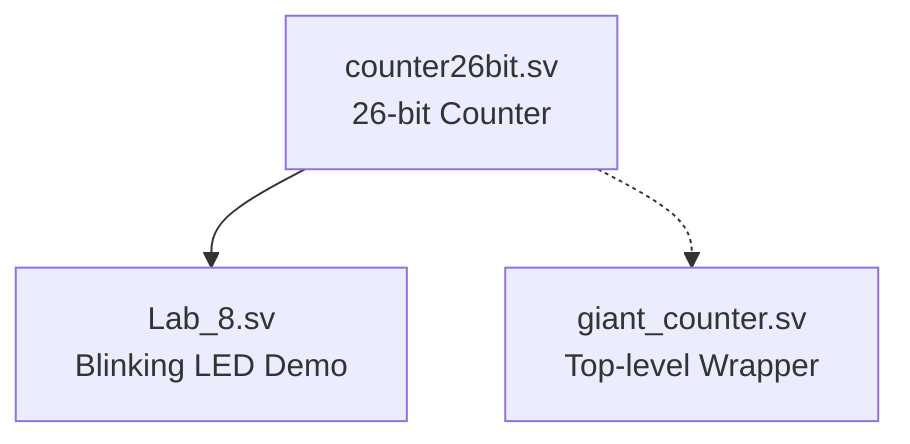
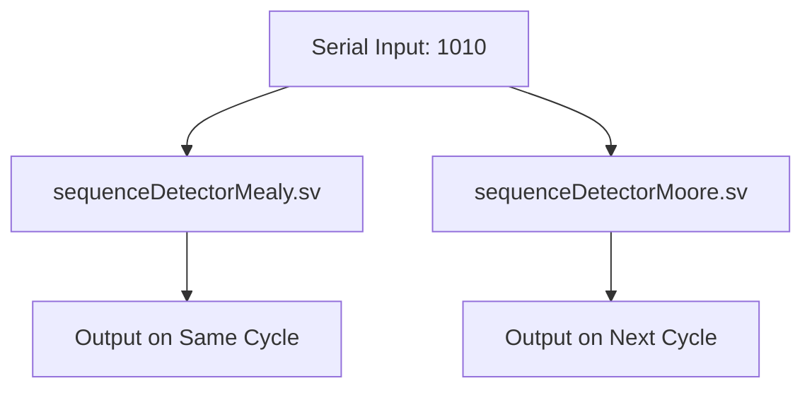
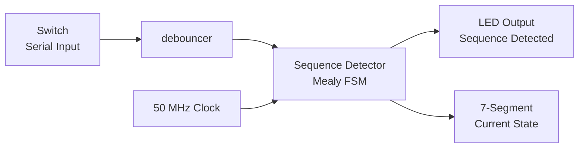

# Architecture Documentation

This document provides a detailed overview of the architecture, design patterns, and module organization in the Digital Logic CSC244 repository.

## Table of Contents

- [System Overview](#system-overview)
- [Hardware Platform](#hardware-platform)
- [Module Hierarchy](#module-hierarchy)
- [Design Patterns](#design-patterns)
- [Data Flow](#data-flow)
- [Timing and Clocking](#timing-and-clocking)

## System Overview

This repository implements a modular digital design framework where:

1. **Simple building blocks** (gates, adders, flip-flops) are composed into
2. **Mid-level components** (decoders, counters, registers) which are then assembled into
3. **Complex systems** (ALU, multiplier, state machines)

### Design Hierarchy Levels

```
Level 1: Primitive Gates (handled by synthesis tool)
         ↓
Level 2: Basic Components
         - Full Adder
         - SR Latch
         - D Latch
         ↓
Level 3: Building Blocks
         - 4-bit Adder
         - D Flip-Flop
         - Decoders
         - Registers
         ↓
Level 4: Functional Units
         - ALU
         - Multiplier
         - State Machines
         - Counters
         ↓
Level 5: Top-Level Systems
         - Lab implementations
         - Demonstration circuits
```

## Hardware Platform

### Target Device

**Intel MAX 10 FPGA: 10M50DAF484C7G**

| Specification | Value |
|---------------|-------|
| Logic Elements | 50,000 |
| Embedded Memory | 1,638 Kbits |
| Package | 484-pin FBGA |
| Speed Grade | -7 |
| On-chip PLL | 4 |
| Maximum I/O | 360 pins |

### DE10-Lite Development Board Resources

| Resource | Quantity | Purpose |
|----------|----------|---------|
| User LEDs | 10 | Output indicators |
| Slide Switches | 10 | User inputs |
| Push Buttons | 2 | Control signals (with debouncing) |
| 7-Segment Displays | 6 | Numeric/hexadecimal output |
| 50 MHz Oscillator | 1 | System clock |
| Arduino Headers | 36 pins | External I/O expansion |
| VGA Connector | 1 | Video output (not used in this course) |
| Accelerometer | 1 | Motion sensing (not used in this course) |

### Clock Domain

All designs in this repository operate in a **single clock domain**:

- **Primary Clock**: 50 MHz on-board oscillator (`CLK` or `CLK50MHz`)
- **Derived Clocks**: Generated through frequency division (e.g., 1 Hz in Lab 8)
- **Clock Distribution**: Global clock network ensures low skew

## Module Hierarchy

### Combinational Logic Modules

#### Arithmetic Modules



**Full Adder** (`fulladder.sv`)
- **Inputs**: A, B, Cin
- **Outputs**: S (sum), Cout (carry out)
- **Logic**: Implements S = A ⊕ B ⊕ Cin, Cout = (A∧B) ∨ (B∧Cin) ∨ (A∧Cin)

**4-bit Adder** (`adder4.sv`)
- **Composition**: 4× Full Adders in ripple-carry configuration
- **Propagation Delay**: O(n) where n = bit width

**ALU** (`ALU.sv`)
- **Operations**: 
  - `00`: Addition
  - `01`: Subtraction (via 2's complement)
  - `10`: Bitwise AND
  - `11`: Bitwise OR
- **Flags**: Overflow (V), Carry (C), Negative (Neg), Zero (Z)
- **Parameterized**: Default N=8, can be configured for other widths

**Multiplier** (`mult4.sv`)
- **Algorithm**: Array multiplier using partial products
- **Structure**: 4× Partial Product units cascaded
- **Output**: 8-bit product from 4-bit inputs

#### Decoder Modules



**4-to-16 Decoder** (`dec416.sv`)
- **Function**: One-hot encoding of 4-bit input
- **Enable**: Active-high enable signal
- **Applications**: Address decoding, state display

**7-Segment Decoder** (`decimal7decoder.sv`)
- **Input**: 4-bit binary (supports 2's complement)
- **Output**: 7-segment encoding + sign display
- **Encoding**: Active-low segments (0 = on, 1 = off)

### Sequential Logic Modules

#### Storage Elements



**Design Progression**:
1. **SR Latch** - Asynchronous set/reset
2. **D Latch** - Level-sensitive data storage
3. **D Flip-Flop** - Edge-triggered storage (synchronous)
4. **T/JK Flip-Flops** - Derived from D flip-flop
5. **Register** - Parameterized multi-bit storage

**Key Concept**: All flip-flops use positive edge triggering (`@(posedge CLK)`)

#### Counters



**Counter26bit** (`counter26bit.sv`)
- **Functionality**: 74x163-compatible 4-bit counter extended to 26 bits
- **Control Signals**:
  - `ENP`, `ENT`: Enable signals (active high)
  - `LDb`: Load enable (active low)
  - `CLRb`: Clear (active low, synchronous)
- **Special Features**:
  - Counts to 50,000,000 (1 second at 50 MHz)
  - `RCO`: Ripple carry out when max count reached
  - `isHalf`: High when count > 25,000,000 (half-second indicator)

**Use Case**: Frequency division for human-perceptible timing

#### Finite State Machines



**Mealy FSM** (`sequenceDetectorMealy.sv`)
- **States**: S0, S1, S2, S3 (encoded as 2-bit enum)
- **Output**: Depends on current state AND input
- **Advantage**: Faster response (1 cycle less delay)
- **Sequence**: Detects "1010" pattern

**Moore FSM** (`sequenceDetectorMoore.sv`)
- **States**: S0, S1, S2, S3, S4 (requires extra state)
- **Output**: Depends only on current state
- **Advantage**: More stable output (glitch-free)

**State Encoding**:
```systemverilog
typedef enum {S0, S1, S2, S3} state_t;
state_t currentState, nextState;

always_ff @(posedge CLK)
    currentState <= nextState;

always_comb begin
    // Next state and output logic
end
```

### Utility Modules

**Debouncer** (`debouncer.sv`)
- **Purpose**: Eliminate mechanical switch bounce
- **Method**: Sample input over multiple clock cycles, require stability
- **Implementation**: Shift register or counter-based
- **Critical for**: Button inputs in sequential circuits

**Controllers** (`controller.sv`, `ALUcontroller.sv`)
- **Purpose**: Centralized control logic for complex systems
- **Pattern**: FSM-based control unit
- **Applications**: Multi-cycle operations, instruction decoding

## Design Patterns

### 1. Hierarchical Composition

**Principle**: Build complex circuits from simpler, well-tested modules

**Example**: 4-bit Multiplier
```
4 × Partial Product Units (PP4)
  ↓
4-bit Multiplier (mult4)
  ↓
Top-level Multiplier Design (L7Multiplier)
```

**Benefits**:
- Modularity and reusability
- Easier debugging (test each level independently)
- Clear abstraction boundaries

### 2. Parameterization

**Pattern**: Use parameters for configurable designs

```systemverilog
module ALU #(parameter N = 8) (
    input logic [N-1:0] A, B,
    // ...
);
```

**Benefits**:
- Single module serves multiple widths
- Scalable designs
- Reduced code duplication

**Used in**: ALU, regN, counter26bit

### 3. Synchronous Design

**Rule**: All state changes occur on clock edge

```systemverilog
always_ff @(posedge CLK) begin
    if (reset)
        state <= IDLE;
    else
        state <= next_state;
end
```

**Benefits**:
- Predictable timing
- Avoids race conditions
- Easier static timing analysis

### 4. Separate Combinational and Sequential Logic

**Pattern**: Use `always_ff` for sequential, `always_comb` for combinational

```systemverilog
// Sequential block: state register
always_ff @(posedge CLK)
    currentState <= nextState;

// Combinational block: next-state logic
always_comb begin
    case(currentState)
        // ...
    endcase
end
```

**Benefits**:
- Clear intent (synthesis and simulation)
- Prevents accidental latches
- Easier code review

### 5. Active-Low Control Signals

**Convention**: Some control signals are active-low (indicated by 'b' suffix)

Examples:
- `LDb` - Load (active low)
- `CLRb` - Clear (active low)

**Reason**: Matches standard IC nomenclature (74x163, etc.)

## Data Flow

### Example: 4-bit Adder/Subtractor (Lab 6)

```mermaid
graph LR
    SW[Switches<br/>SW[7:0]] --> A[A Input<br/>4 bits]
    SW --> B[B Input<br/>4 bits]
    SW --> SUB[Sub Control<br/>1 bit]
    
    A --> ADDSUB[addsub4.sv]
    B --> ADDSUB
    SUB --> ADDSUB
    
    ADDSUB --> RESULT[Result<br/>4 bits]
    ADDSUB --> FLAGS[Overflow, Carry]
    
    RESULT --> DEC[decimal7decoder]
    DEC --> HEX[7-Segment Display]
```

**Flow**:
1. User sets inputs via switches
2. Adder/subtractor computes result and flags
3. Result converted to 7-segment encoding
4. Display shows decimal value

### Example: Sequence Detector (Lab 5)



**Flow**:
1. Serial input from switch (debounced)
2. FSM processes each bit on clock edge
3. Output LED lights when "1010" detected
4. Current state displayed on 7-segment

### Example: ALU with Multiplier (Lab 7)

```mermaid
graph TD
    SWA[SW[7:4]<br/>Operand A] --> MUX1{Source<br/>Select}
    SWB[SW[3:0]<br/>Operand B] --> MUX2{Source<br/>Select}
    
    MUX1 --> ALU[8-bit ALU]
    MUX2 --> ALU
    
    SWA --> MULT[4-bit Multiplier]
    SWB --> MULT
    
    MULT --> MUX1
    MULT --> MUX2
    
    CTRL[SW[9:8]<br/>Operation] --> ALUCTL[ALU Controller]
    ALUCTL --> ALU
    
    ALU --> RES[Result Display]
    ALU --> FLAGS[V, C, N, Z LEDs]
```

**Flow**:
1. User selects operation mode
2. Controller routes data through multiplier or directly to ALU
3. ALU performs operation
4. Result and flags displayed

## Timing and Clocking

### Clock Distribution

All designs use the DE10-Lite's 50 MHz oscillator:

```
50 MHz Oscillator (PIN_P11)
  ↓
Global Clock Network
  ↓
┌─────────────┬─────────────┬─────────────┐
│  Sequential │   Counters  │    FSMs     │
│  Logic      │             │             │
└─────────────┴─────────────┴─────────────┘
```

**Clock Characteristics**:
- **Frequency**: 50 MHz
- **Period**: 20 ns
- **Jitter**: < 100 ps (FPGA PLL locked)
- **Skew**: Minimal (global clock tree)

### Frequency Division

**Lab 8 demonstrates clock division**:

```
50 MHz Input Clock
  ↓
26-bit Counter (counts to 50,000,000)
  ↓
1 Hz Output (RCO pulse)
  ↓
LED Blink (1 second period, 50% duty cycle)
```

**Calculation**:
- Target frequency: 1 Hz
- Source frequency: 50 MHz
- Division ratio: 50,000,000
- Counter bits needed: ⌈log₂(50,000,000)⌉ = 26 bits

### Timing Constraints

**Setup Time** (t_su): Time data must be stable before clock edge
**Hold Time** (t_h): Time data must remain stable after clock edge
**Clock-to-Q** (t_cq): Flip-flop propagation delay

**Critical Path**: Longest combinational path between registers
- In ALU: Register → Add/Sub → Overflow Logic → Register
- Quartus automatically optimizes to meet timing

### Synchronous vs Asynchronous Resets

**This repository uses synchronous resets**:

```systemverilog
always_ff @(posedge CLK) begin
    if (reset)  // Synchronous reset
        state <= IDLE;
    else
        state <= next_state;
end
```

**Advantages**:
- No metastability from async reset
- Easier static timing analysis
- Consistent with modern FPGA design practices

## File Organization Best Practices

### Naming Conventions

- **Module files**: `module_name.sv`
- **Top-level files**: `Lab_X.sv` or descriptive name
- **Backup files**: `*.sv.bak` (not included in projects)

### Project Organization

Each lab follows this structure:
```
Lab X - Topic/
├── Lab Manual.pdf          # Specification
├── LX Subtopic/           # Subdirectories per question
│   ├── *.sv               # Source files
│   ├── *.qpf              # Quartus project
│   └── *.qsf              # Pin assignments
└── Circuit Files (*.cv)   # Simulation/schematic
```

### Module Reuse Strategy

1. **Development**: Create module in lab directory
2. **Testing**: Verify functionality on FPGA
3. **Promotion**: Copy to `SV Modules Bank/` for reuse
4. **Documentation**: Add header comments with interface description

This architecture promotes modular design, code reuse, and systematic complexity building—key principles in digital design.
