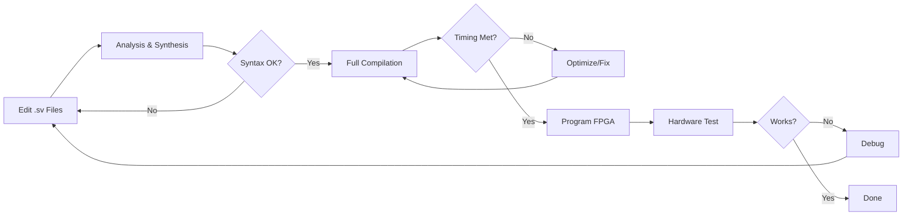

# Development Guide

This guide covers setting up your development environment, working with the codebase, and best practices for FPGA development with this repository.

## Table of Contents

- [Development Environment Setup](#development-environment-setup)
- [Project Structure](#project-structure)
- [Workflow](#workflow)
- [Building and Testing](#building-and-testing)
- [Debugging](#debugging)
- [Best Practices](#best-practices)
- [Common Issues](#common-issues)

## Development Environment Setup

### Required Software

#### 1. Intel Quartus Prime Lite Edition

**Version**: 22.1std.1 or later (Free)

**Download**:
- Windows: [Intel FPGA Software Download](https://www.intel.com/content/www/us/en/software-kit/785085/intel-quartus-prime-lite-edition-design-software-version-22-1-1-for-windows.html)
- Linux: [Intel FPGA Software Download](https://www.intel.com/content/www/us/en/software-kit/785086/intel-quartus-prime-lite-edition-design-software-version-22-1-1-for-linux.html)

**Installation**:
1. Download the installer (approximately 5 GB)
2. Run installer and select:
   - Quartus Prime (required)
   - ModelSim (optional, for simulation)
   - MAX 10 device support (required)
3. Install USB Blaster drivers during installation
4. Add Quartus to system PATH:
   - Windows: `C:\intelFPGA_lite\22.1\quartus\bin64`
   - Linux: `/opt/intelFPGA_lite/22.1/quartus/bin`

**Verification**:
```bash
# Check installation
quartus_sh --version

# Expected output:
# Version 22.1std.1 Build 917 02/14/2023 SC Lite Edition
```

#### 2. Text Editor (Optional but Recommended)

While Quartus includes a built-in text editor, external editors provide better features:

**VS Code** (Recommended):
- Install [VS Code](https://code.visualstudio.com/)
- Install extensions:
  - **SystemVerilog - Language Support** (eirikpre.systemverilog)
  - **Verilog-HDL/SystemVerilog** (mshr-h.veriloghdl)
  - **FPGA Linter** (for syntax checking)

**Vim/Emacs**:
- Use SystemVerilog syntax highlighting plugins

**Configuration**:
- Set tab width to 4 spaces (matches existing code style)
- Enable syntax highlighting for `.sv`, `.v` files
- Configure auto-save (Quartus auto-reloads on file change)

### Hardware Setup

#### DE10-Lite FPGA Board

**Connection**:
1. Connect board to PC via USB cable (Type B connector)
2. Power LED should illuminate
3. Windows will install USB Blaster drivers automatically
4. Linux may require manual driver setup

**Driver Verification** (Windows):
```
Device Manager → Universal Serial Bus controllers → USB-Blaster
```

**Driver Verification** (Linux):
```bash
# Check device recognition
lsusb | grep Altera

# Expected output:
# Bus 001 Device 00X: ID 09fb:6010 Altera USB-Blaster
```

**Troubleshooting**:
- If device not detected, reinstall drivers from `<quartus_install>/drivers/usb-blaster/`
- Try different USB port or cable
- Check board power switch is ON

## Project Structure

### Repository Layout

```
Digital-Logic-CSC244/
├── Lab X - Topic/
│   ├── LX Subtopic/
│   │   ├── *.sv                    # SystemVerilog source files
│   │   ├── project_name.qpf        # Quartus project file
│   │   ├── project_name.qsf        # Quartus settings file
│   │   ├── db/                     # Analysis & synthesis database (auto-generated)
│   │   ├── incremental_db/         # Incremental compilation data (auto-generated)
│   │   └── output_files/           # Compilation output (auto-generated)
│   │       ├── *.sof               # Programming file (SRAM Object File)
│   │       ├── *.pof               # Programming file (Programmer Object File)
│   │       └── *.rpt               # Compilation reports
│   └── *.pdf                       # Lab manual/specification
├── SV Modules Bank/                # Reusable module library
└── docs/                          # Documentation
```

### File Types

| Extension | Purpose | Auto-Generated |
|-----------|---------|----------------|
| `.sv` | SystemVerilog source code | No |
| `.qpf` | Quartus project file (XML) | No |
| `.qsf` | Settings/constraints (pin assignments, timing) | No |
| `.sof` | SRAM programming file (volatile) | Yes |
| `.pof` | Flash programming file (non-volatile) | Yes |
| `.rpt` | Compilation reports (timing, resource usage) | Yes |
| `.bak` | Backup files | Yes |

### Important: .gitignore

Auto-generated files should not be committed. Ensure `.gitignore` includes:
```
db/
incremental_db/
output_files/
*.bak
*.bsf
*.done
*.rpt
*.summary
*.smsg
*.jdi
*.sld
*.qws
```

## Workflow

### Starting a New Project

#### Option 1: Using Existing Lab Project

```bash
# Navigate to lab directory
cd "Lab X - Topic/LX Subtopic"

# Open Quartus project
quartus project_name.qpf
```

#### Option 2: Creating New Project from Scratch

1. **Launch Quartus**:
   ```bash
   quartus &
   ```

2. **New Project Wizard** (`File > New Project Wizard`):
   - **Page 1**: Set working directory and project name
   - **Page 2**: Select `Empty project`
   - **Page 3**: Add SystemVerilog files (`.sv`)
   - **Page 4**: Device selection:
     - Family: `MAX 10`
     - Device: `10M50DAF484C7G`
   - **Page 5**: EDA tool settings (skip unless using ModelSim)
   - **Page 6**: Review and finish

3. **Set Top-Level Entity**:
   ```
   Assignments → Settings → General → Top-level entity
   ```

4. **Pin Assignments**:
   - Import from existing `.qsf` file, or
   - Manual assignment via `Assignments > Pin Planner`

### Development Cycle



### Editing Source Files

**External Editor Workflow** (Recommended):
1. Open files in VS Code (or preferred editor)
2. Make changes and save
3. Quartus auto-detects changes
4. Run Analysis & Synthesis to verify

**Quartus Built-in Editor**:
1. Double-click file in Project Navigator
2. Edit in Quartus text editor
3. Save (`Ctrl+S`)
4. Run Analysis & Synthesis

### Incremental Changes

For small changes (e.g., fixing a typo):
```
Processing → Start → Start Analysis & Synthesis
```
This is faster than full compilation and catches syntax errors.

For logic changes requiring placement/routing:
```
Processing → Start Compilation
```
This performs full compilation including timing analysis.

## Building and Testing

### Compilation Steps

#### 1. Analysis & Synthesis
**Purpose**: Parse SystemVerilog, elaborate design, synthesize to gates

**Command**:
```
Processing → Start → Start Analysis & Synthesis
```

**Output**:
- `*.rpt` files in `output_files/`
- Check `Analysis & Synthesis Report` for warnings

**Common Warnings (can usually ignore)**:
- `Inferred latch` (if intentional, or using `always_comb`)
- `Signal X is stuck at GND/VCC` (unused inputs/outputs)

#### 2. Fitter (Place & Route)
**Purpose**: Map logic to physical FPGA resources, route connections

**Included in**: Full Compilation

**Output**:
- Resource utilization report
- Pin assignment report

#### 3. Timing Analysis
**Purpose**: Verify design meets timing requirements

**Included in**: Full Compilation

**Check**:
```
Compilation Report → TimeQuest Timing Analyzer → Slow 1200mV 85C Model → Fmax Summary
```

**Expected**: Should comfortably exceed clock frequency (50 MHz)

#### 4. Assembler
**Purpose**: Generate programming file (`.sof`)

**Included in**: Full Compilation

**Output**:
```
output_files/project_name.sof
```

### Programming the FPGA

#### Using Quartus Programmer

1. **Connect Board**:
   - Power on DE10-Lite
   - Connect USB cable

2. **Open Programmer**:
   ```
   Tools → Programmer
   ```

3. **Auto Detect Hardware**:
   - Click `Hardware Setup`
   - Select `USB-Blaster [USB-0]` (or similar)
   - Click `Auto Detect`
   - Should show `10M50DA` device

4. **Add Programming File**:
   - Click `Add File`
   - Select `output_files/project_name.sof`
   - Check `Program/Configure` checkbox

5. **Program**:
   - Click `Start`
   - Progress bar should complete to 100%
   - `Status` shows `Successful`

6. **Verify**:
   - Test design on hardware immediately
   - SRAM configuration is volatile (lost on power-off)

#### Command-Line Programming

```bash
# Program FPGA with .sof file
quartus_pgm -c USB-Blaster -m JTAG -o "p;output_files/project.sof@1"
```

### Simulation (Optional)

**Using ModelSim**:
1. Create testbench (`.sv` file with `module testbench`)
2. Launch simulation:
   ```
   Tools → Run Simulation Tool → RTL Simulation
   ```
3. View waveforms in ModelSim

**Note**: Most labs in this repository verify functionality directly on hardware rather than simulation.

## Debugging

### Debug Strategies

#### 1. LED Debugging (Most Common)

**Use LEDs to observe internal signals**:
```systemverilog
// Assign internal signals to LEDs for observation
assign LEDR[0] = enable_signal;
assign LEDR[1] = state[0];
assign LEDR[2] = carry_out;
```

**Tip**: Use 7-segment displays to show numeric values

#### 2. Incremental Testing

**Build complexity gradually**:
1. Test basic building blocks first (e.g., full adder)
2. Combine into larger units (e.g., 4-bit adder)
3. Integrate into complete system

#### 3. Signal Tap Logic Analyzer (Advanced)

**Built-in logic analyzer**:
1. `Tools → Signal Tap Logic Analyzer`
2. Add signals to monitor
3. Set trigger conditions
4. Capture waveforms in real-time

**Use case**: Debugging timing-sensitive issues

### Common Issues and Solutions

#### Issue: Compilation Errors

**Error**: `Error (10170): Verilog HDL syntax error`
**Solution**: 
- Check line number in error message
- Common causes: missing semicolon, mismatched parentheses, typos
- Verify `always_comb` vs `always_ff` usage

**Error**: `Error (12006): Node "X" is missing`
**Solution**:
- Signal declared but never assigned
- Check for typos in signal names
- Ensure all outputs are assigned

#### Issue: Design Doesn't Work on Hardware

**Problem**: Synthesis succeeds, but hardware doesn't behave correctly

**Debug Steps**:
1. **Verify pin assignments**:
   - `Assignments → Pin Planner`
   - Compare with DE10-Lite user manual
   - Common: `CLK` = PIN_P11, `SW[0]` = PIN_C10

2. **Check signal polarity**:
   - LEDs: Active-low on DE10-Lite (0 = on)
   - 7-segment: Active-low (0 = segment on)
   - Buttons: Active-low (pressed = 0)

3. **Test with simple design**:
   - Program a simple passthrough: `assign LEDR[0] = SW[0];`
   - Verify hardware connection

#### Issue: Timing Violations

**Warning**: `Critical Warning (332148): Timing requirements not met`

**Solution**:
- Check `TimeQuest Timing Analyzer` report
- Identify critical path
- Simplify combinational logic
- Add pipeline registers if needed
- For this course, 50 MHz should be easily achievable

#### Issue: Inferred Latches

**Warning**: `Warning (10631): Verilog HDL Procedural Assignment warning: latch inferred`

**Solution**:
- Use `always_comb` for combinational logic
- Ensure all paths assign to output:
  ```systemverilog
  always_comb begin
      output_val = default_value;  // Default assignment
      case(selector)
          2'b00: output_val = ...
          2'b01: output_val = ...
          // All cases covered
      endcase
  end
  ```

## Best Practices

### Coding Standards

**File Organization**:
```systemverilog
// Module header comment
/**
 * Module Name: adder4
 * Description: 4-bit ripple-carry adder
 * Inputs: A[3:0], B[3:0], Cin
 * Outputs: Sum[3:0], Cout
 */

module adder4(
    input logic [3:0] A, B,
    input logic Cin,
    output logic [3:0] Sum,
    output logic Cout
);

    // Internal signals
    logic [2:0] carry;
    
    // Module instantiations or logic
    // ...

endmodule
```

**Naming Conventions**:
- **Modules**: `lowercase_with_underscores` or `camelCase`
- **Signals**: `descriptive_names` (avoid `a`, `b`, `c`)
- **Constants**: `UPPERCASE_WITH_UNDERSCORES`
- **Active-low signals**: Suffix with `b` (e.g., `resetb`, `enableb`)

**Code Style**:
- Indent: 4 spaces (no tabs)
- Use `logic` instead of `wire` (SystemVerilog best practice)
- Prefer `always_ff` for sequential, `always_comb` for combinational
- Add comments for complex logic

### Version Control

**Git Workflow**:
```bash
# Create feature branch
git checkout -b lab-8-counter

# Make changes, test, commit
git add "Lab 8 - Counters Shift Reg/L8 Giant Counter/*.sv"
git commit -m "Implement 26-bit counter with frequency division"

# Push to remote
git push origin lab-8-counter
```

**DO NOT commit**:
- `db/`, `incremental_db/`, `output_files/`
- `*.bak`, `*.rpt`, `*.summary`

**DO commit**:
- `*.sv` (source code)
- `*.qpf`, `*.qsf` (project settings)
- `*.pdf` (documentation)

### Testing Strategy

1. **Unit Testing**: Test individual modules
   - Use simple top-level wrappers
   - Connect inputs to switches, outputs to LEDs
   
2. **Integration Testing**: Test combined modules
   - Verify interfaces between modules
   - Check for timing issues

3. **Hardware Verification**: Final test on FPGA
   - Test all input combinations (if feasible)
   - Verify edge cases
   - Document expected vs actual behavior

## Common Quartus Shortcuts

| Action | Shortcut |
|--------|----------|
| Save | `Ctrl+S` |
| Compile | `Ctrl+L` |
| Analysis & Synthesis | `Ctrl+K` |
| Open Programmer | `Ctrl+P` (after opening Tools menu) |
| Find | `Ctrl+F` |
| Find in Files | `Ctrl+Shift+F` |

## Resources

### Official Documentation

- [Intel Quartus Prime User Guide](https://www.intel.com/content/www/us/en/docs/programmable/683432/current/introduction-to-prime-pro-edition.html)
- [DE10-Lite User Manual](https://www.terasic.com.tw/cgi-bin/page/archive.pl?Language=English&No=1021&PartNo=4)
- [MAX 10 FPGA Device Handbook](https://www.intel.com/content/www/us/en/docs/programmable/683794/current/overview.html)

### Learning Resources

- [FPGA4Student - SystemVerilog Tutorials](https://www.fpga4student.com/p/verilog-tutorial.html)
- [Nandland - FPGA Tutorials](https://nandland.com/)
- [Intel FPGA Training](https://www.intel.com/content/www/us/en/programmable/support/training/overview.html)

### Community

- [Intel FPGA Forum](https://community.intel.com/t5/Intel-Quartus-Prime-Software/bd-p/quartus-prime-software)
- [FPGA Reddit](https://www.reddit.com/r/FPGA/)
- [Stack Overflow - FPGA Tag](https://stackoverflow.com/questions/tagged/fpga)

---

**Need Help?**
- Check lab PDF for specific requirements
- Review [ARCHITECTURE.md](ARCHITECTURE.md) for design patterns
- Consult Quartus error messages (often include helpful suggestions)
- Test incrementally - don't debug a large design all at once
